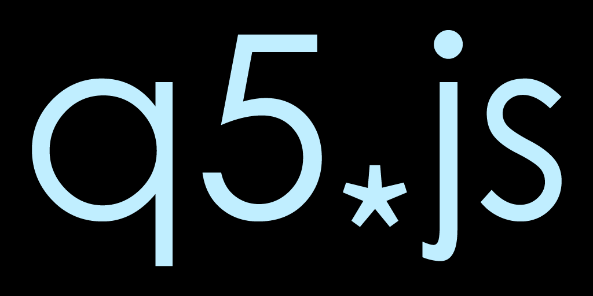

#  

**q5.js** implements all of [p5][]'s 2D drawing, math, and user input functionality.

It's a drop-in replacement that's performance optimized and 23x smaller than p5. q5 even has a few exclusive features: top-level global mode, HDR color support, namespace mode, and text image caching.

But q5 doesn't include any friendly error messages, so its mainly for people who are already familiar with p5.js or JS programming in general. If you're a beginner, stick with p5 while developing a sketch, then use q5 to share your work.

## Usage

q5 should work with your existing p5.js sketches, no modifications required! If you have any problems though, please [make an issue report][].

Use q5.js in your own project by adding this line to your HTML file:

```html
<script src="https://q5js.org/q5.js"></script>
```

q5 is also available on [npm](https://www.npmjs.com/package/q5)!

```bash
npm install q5
```

Or try out the [q5.js template sketch](https://editor.p5js.org/quinton-ashley/sketches/8SEtLEDl9) for the online p5.js Web Editor.

## Support this project 🤝

q5 is open source and [multi-licensed](https://github.com/quinton-ashley/p5play-web/blob/main/LICENSING.md). Anyone can use q5 for free under the terms of the AGPLv3. 🎉

But if you want to use q5 commercially in a closed source product or service, you must comply with the [p5play Professional License](https://github.com/quinton-ashley/p5play-web/blob/main/pro/LICENSE.md), which is only available to current p5play [GitHub Sponsors](https://github.com/sponsors/quinton-ashley) or [Patreon](https://www.patreon.com/p5play) members paying for the appropriate tier.

If you can't afford to pay, you can apply for the free [p5play Novice License](https://github.com/quinton-ashley/p5play-novice/blob/main/LICENSE.md). See [LICENSING.md](https://github.com/quinton-ashley/p5play-web/blob/main/LICENSING.md) for more info.

## Using p5 Addon Libraries

q5.js is compatible with popular p5 addons and projects that use p5, such as [p5play][], because it aliases `Q5` to `p5`.

To use addons, simply load them after q5.js:

```html
<script src="q5.js"></script>
<!-- load p5 addons after q5 -->
<script src="https://p5play.org/v3/planck.min.js"></script>
<script src="https://p5play.org/v3/p5play.js"></script>
```

## New Features: Top-Level Global Mode

> q5.js includes some exclusive features that aren't available in p5.js. Using them is optional!

In **p5**, functions like `rect` can't be used on the file level. They must be called from within p5 functions like `setup` and `draw`.

In **q5**, existing p5 2D sketches don't require any modification. But if you initialize Q5 at the top of your sketch, the `preload` and `setup` functions become optional.

```js
new Q5();

noStroke();
let c = color(0, 126, 255, 102);
fill(c);
rect(15, 15, 35, 70);
```

This is great because you don't have to declare variables on the file level and then define them in `preload` or `setup`. You can declare and define them at the same time!

```js
new Q5();

let cow = loadImage('cow.png');

preload();

function setup() {
	image(cow, 0, 0);
}
```

Note that if you use `loadImage` on the file level, q5 will wait to run `setup` and `draw` until the image loads. Optionally if you forgo defining `preload`, you can run it to signify that the sketch can start once loading is complete. Otherwise q5 will auto-start the sketch after 32ms of delay, this ensures code after `new Q5()` is run before the sketch starts.

## New Features: HDR Color Support

Most modern devices support the "display-p3" HDR color space. If a device doesn't support it, q5 will fall back to "srgb".

In **q5**, `colorMode` accepts 'rgb', 'srgb', and 'oklch'. The default mode is 'rgb', which upgrades rgb colors to HDR on supported displays. Specifying 'srgb' on an HDR capable device enables sRGB gamut correction for rgb colors.

The [oklch](https://oklch.com/#63.65,0.2872,16.57,100) color format is the best way to work with HDR colors!

https://evilmartians.com/chronicles/oklch-in-css-why-quit-rgb-hsl

```js
colorMode('oklch');

//       (lightness, chroma, hue, alpha)
let c = color(0.637, 0.287, 16.57, 1);
```

The `color` function doesn't accept percentages so you'll have to convert those to decimal values. Also its string parsing capability is limited to simple named colors and the hex "#RRGGBB" or "#RRGGBBAA" formats.

Use `new Color()` to create color objects without any parsing overhead.

q5 also exposes color components as single letter properties of `Color` objects. For example, you can easily change the red of rgb colors like this `c.r = 128` or the hue of oklch colors like this `c.h = 180`.

Support for the HSV color format was removed in q5 v1.9.3 because color experts thought HSV was flawed, outdated, and ought to be abandoned way back in 1997! oklch is superior in every way.

https://en.wikipedia.org/wiki/HSL_and_HSV#Disadvantages

## New Features: Customize Canvas Context Attributes

In **p5**, you're stuck with the default [canvas context attributes][], which can't be changed. So the canvas must have an alpha layer, even if you don't need one. Also p5 doesn't support HDR color spaces or [desynchronized rendering][].

But **q5** has its own defaults:

```js
Q5.canvasOptions = {
	alpha: false,
	desynchronized: false,
	colorSpace: 'display-p3'
};
```

The `Q5.canvasOptions` object can be overridden, which will effect all q5 instances.You can also override any of these defaults by passing an options object as the fourth parameter to the `createCanvas()` function:

```js
createCanvas(400, 400, '2d', {
	alpha: true
});
```

## New Features: Namespace Mode

**p5**'s [instance mode][] enables multiple sketches to run on one page. To avoid needing to preface every p5 function with `p.` you can use a JS [with statement][].

```js
let sketch = (p) => {
	with (p) {
		p.setup = () => {
			createCanvas(400, 400);
		};
		p.draw = () => {
			background(100);
		};
	}
};

let myp5 = new p5(sketch);
```

**q5** introduces "namespace" mode, in addition to the global and instance modes. You can call the namespace variable whatever you like.

```js
let q = new Q5('namespace');

with (q) {
	q.setup = () => {
		createCanvas(400, 400);
	};
	q.draw = () => {
		background(100);
	};
}
```

## Node.js Usage

> Node.js support was recently added, please [make an issue report][] if you encounter any problems.

If you're not interested in rendering to a canvas, q5.js can be used in node.js without any additional dependencies. Just use `noCanvas()` in your sketch and don't call any drawing functions that require a canvas.

If you want to render to a canvas, you'll need to install the `canvas` and `jsdom` packages.

```bash
npm install canvas jsdom
```

q5 will automatically load and configure `canvas` and `jsdom` if they are installed. `Q5`, `cairoCanvas`, and `JSDOM` will be added to the global scope by `require('q5')`.

In node.js, q5's automatic global mode is disabled. To use global mode you need to assign q5 user defined functions like `draw` and `setup` to the `global` object then call `new Q5()`. q5 will add q5 variables and functions to the `global` object, just like it adds them to the `window` object in the browser.

## Motivation: Part 1

> This section was written by @LingDong-, co-creator of q5.

After having used many graphics libraries across many different languages, I have found that the Processing/p5.js/Openframeworks system has one huge advantage over others:

It gets stuff drawn onto the screen quick and easy!

This might sound silly, but it actually means a lot for people concerned with creative expression. The easier it is to try things out, before one's time and patience is up, the greater chance that you'll get something nice in the end. Therefore, although you can theoretically achieve the exact same result in any decent graphics system, the tool does matter in practice. Artists want more time to spend actually working on how their piece looks, instead of wondering why the computer doesn't work as intended.

At [Carnegie Mellon University](https://www.cmu.edu/cfa/studio/index.html), where I studied computational art, p5.js is taught as _the_ framework for the web, and its been a great introduction. However, due to some of the ways in which p5.js is implemented, I found myself using it less and less as I made more and more projects. Lately, I've found that I'll reach directly for the standard JavaScript/Web APIs instead of p5.js. I sometimes think of this as shedding the training wheels on one's bicycle. But I missed the artist-centered logic of the p5 interface! I started thinking, "Is there a better way?"

Just to clarify, I think the official p5.js implementation is perfectly justified for its philosophy and suitability for its intended purpose, but my own needs are different enough that I think they justify another implementation instead of pull requests to the official one.

In fact, its not uncommon for successful software systems to have multiple implementations of the same spec (think: compilers of C, implementations of SQL, and engines of JavaScript). This allows the user to choose a backend that best suits their goals or needs. When one is using p5.js (or Processing or OpenFrameworks), what one is really using is the same set of commands, the intuitive way of describing drawings, that empowers creative expression. The actual way these commands are implemented internally is incidental; it should be possible to swap internal implementations as necessary.

## Motivation: Part 2

> This section was written by @quinton-ashley, co-creator of q5.

I thought @LingDong-'s work on q5 and the idea itself had great potential, so I decided to implement more of the p5.js API. My main goal was to make it work with [p5play](https://p5play.org)!

An increase in performance of even a few frames per second can make a significant difference in the user experience of a work of interactive art or a game, especially on mobile devices.

I was also interested in working on q5 because for a lot of p5.js users, the library itself is a black box. Even as an expert JS programmer and someone who teaches CS for a living, I still find myself scratching my head when I look at the p5.js source code. p5 was initially released 10 years ago and bad design choices were made due to JS limitations at the time. It's also become an absolutely massive library, with literally over 100,000 lines of code and documentation!

I think it'd be better if the canvas mode, webgl mode, Friendly Error System, and accessibility features of p5 were offered in separate files. Yet, the powers that be at the Processing Foundation have made it clear that they don't want to do that. Instead they insist on adding more accessibility features to the base library, which the majority of people just don't need. So q5 is a good alternative that trims out the fat.

Thanks in large part to @LingDong-'s design, q5 is well organized, concise, and utilizes many modern JS features! I think even without inline documentation, the source code is easier for experienced JS programmers to comprehend.

## More exclusive features

Features added by @quinton-ashley:

- `opacity(globalAlpha)`: set the opacity multiplier for anything subsequently drawn to the canvas in a range between 0 (transparent) and 1 (opaque).
- `textCache(enabled)`: Text image caching is enabled by default. Rotated text is only rendered once, and then cached as an image. This can result in ridiculously high 90x performance boosts for text-heavy sketches. Users don't need to change their code, the `text` function can be used as normal, q5 takes care of everything behind the scenes.
- `createImage`, `loadImage`, and `createGraphics`: as a last parameter to these functions, `opt` (options) object, users can specify canvas context attributes for an image or graphic. `opt.alpha` is set to true by default.
- `loadSound(file)`: Returns a Web Audio object with `setVolume()` and `setLoop()` functions added to it. Not as powerful as p5.sound, but it's good enough in some cases.
- `ctx`: an instance level alias for `drawingContext`

Features added by @LingDong-:

- `randomExponential()` in addition to `randomGaussian()`: a random distribution that resembles exponential decay.
- `curveAlpha()`: manipulate the `α` parameter of Catmull-Rom curves.
- `relRotationX`, `relRotationY` and `relRotationZ`: Similar to `rotationX/Y/Z`, but are relative to the orientation of the mobile device.

## Limitations

- `color` function only accepts numeric input, hex, and simple named colors. It doesn't parse strings like `color('hsl(160, 100%, 50%)')`. This was done to keep the codebase small and easier to understand.

## Size Comparison

Unminified:

- p5.js **4300kb** ⚠️
- p5.sound.js 488kb
- q5.js 66kb

Minified:

- p5.min.js 1000kb
- p5.sound.min.js 200kb
- q5.min.js **42kb** 🎉

## Benchmarks

q5.js has a significant speed advantage in imaging operations because it uses hardware accelerated Canvas APIs whenever possible, instead of going pixel by pixel. Most other functionalities have very marginal speed improvements (or none at all when parameter validation overhead is negligible). The operations with important performance differences are listed below.

The following benchmarks are generated with Google Chrome 120, on a MacBook Air M1 2020. q5.js v1.9.3 vs p5.js v1.9.0.

Less time (milliseconds) is better.

| Task                                              | p5.js | q5.js |
| ------------------------------------------------- | ----- | ----- |
| Generate 10,000 random colors with `color(r,g,b)` | 33ms  | 3ms   |

## Older Benchmarks

The following benchmarks are generated with Google Chrome 84, on an old-ish MacBook Pro 2015 (with lots of apps and tabs running); Performance varies depending on software and hardware. p5.js version used is v1.1.9.

Higher FPS (frames per second) is better.

| Operation on 1024x1024 image | p5.js | q5.js    |
| ---------------------------- | ----- | -------- |
| tinting                      | 20FPS | 35FPS    |
| blurring(11px)               | 0FPS  | 40FPS \* |
| thresholding                 | 10FPS | 40FPS \* |
| grayscaling                  | 10FPS | 50FPS \* |
| inverting                    | 10FPS | 50FPS \* |
| opaque                       | 20FPS | 60FPS    |
| erode/dilate                 | 5FPS  | 9FPS     |

| Task                                                | p5.js | q5.js |
| --------------------------------------------------- | ----- | ----- |
| Generating 10,000 `randomGaussian()` sample         | 10FPS | 20FPS |
| Calling `noiseSeed()` 1,000 times                   | 10FPS | 60FPS |
| Generate 10,000 (random) colors with `color(r,g,b)` | 5FPS  | 60FPS |
| Rotate a `Vector` 1,000,000 times                   | 13FPS | 60FPS |

<sub>\* Only for browsers that support CanvasRenderingContext2D.filter ([75% of all](https://caniuse.com/#feat=mdn-api_canvasrenderingcontext2d_filter) as of Aug 2020, including Chrome, Firefox and Edge). For those that don't, performance is similar to p5.js, as identical implementations are usually used as fallbacks.</sub>

## Contributing

Speed is a goal for q5.js, and we would very much like to see the above list grow. If you know how to make something faster, advice/pull requests are very welcome!

## Licensing

q5.js is not affiliated with the Processing Foundation. p5.js is licensed under the LGPLv2, the two small sections of p5.js' code were directly copied into q5.js are credited below. The rest of q5 is a new implementation of part of the p5.js API. APIs are not copyrightable in the United States, as decided by the Supreme Court in the Google v Oracle case.

@LingDong- created the original q5xjs library and licensed it under the MIT license.

@quinton-ashley created q5.js (this project) which contains many bug fixes, additional p5.js API implementations, and several exclusive features. q5.js is licensed under the AGPLv3.

## Credits

catmullRomSpline:
https://en.wikipedia.org/wiki/Centripetal_Catmull%E2%80%93Rom_spline

ziggurat:
http://ziggurat.glitch.me/

random:
https://github.com/processing/p5.js/blob/1.1.9/src/math/noise.js

Curve query:
https://github.com/processing/p5.js/blob/1.1.9/src/core/shape/curves.js

[p5]: https://p5js.org
[p5play]: https://p5play.org
[instance mode]: https://p5js.org/examples/instance-mode-instantiation.html
[with statement]: https://developer.mozilla.org/en-US/docs/Web/JavaScript/Reference/Statements/with
[make an issue report]: https://github.com/quinton-ashley/q5.js/issues
[canvas context attributes]: https://developer.mozilla.org/en-US/docs/Web/API/HTMLCanvasElement/getContext#contextattributes
[desynchronized rendering]: https://github.com/whatwg/html/issues/5466
